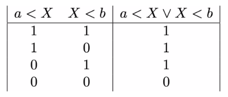

# The logical disjunction

Lets now introduce the logical disjunction operator and using this to write longer logical propositions such as:


If we wanted to write a python program to set a variable called `c` equal to 3 if this condition was true we would then write the following code:

````
if a < X or X < b : c = 3
````

The truth value of the proposition above is determined from the truth values of the two propositions of which it is composed using the following truth table:



__To complete the exercise you will need to use the ideas above to complete the function called `numberOutside`.__  This function takes three arguments:

1. `data` - a numpy array containing a list of numbers
2. `a` - a single integer  
3. `b` - a second integer which is greater than `a`

Your function should return the number of elements in `data` that are less than `a` or greater than `b`.

